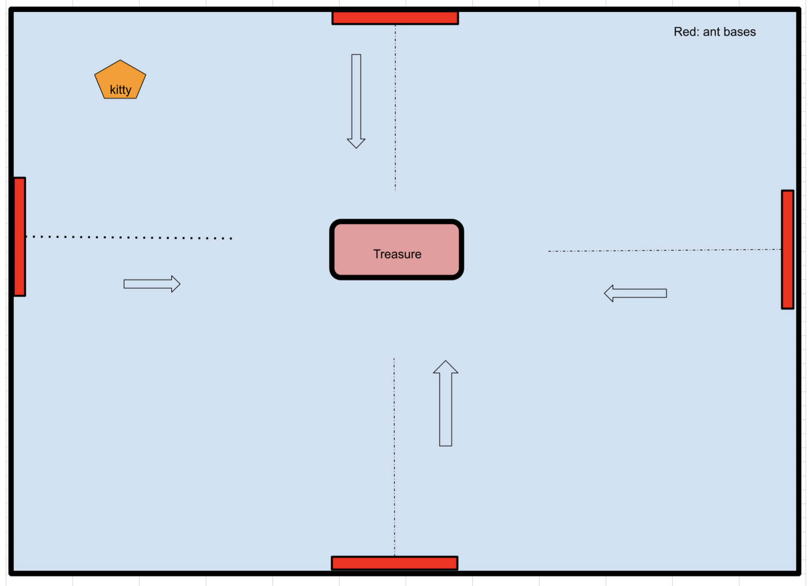

# Kitty Treasure Guard
Help the kitty guard its treasures from the ants!

## Game Plan
The ants will come out from 4 side of the room, trying to reach the treasures placed in the middle of the room. Kitty is to move around the room stopping the ants from getting to the treasure. Kitty is able to attack the 4 ant bases, which will stop the ants for 3 seconds. Kitty can also cut through the ants, which will slow down the ants for 3 seconds. However it can only attack brown ants, kitty will die if it stops the poisonous red ants. Kitty can scare the ants 2 times in 1 game. Press "h" to Hiss, it will scare the cats away for 2 seconds. Player's score goes up as kitty makes each attack until they lose the game. Maximum game time is 1 minute.

=======

## Tech being used
* HTML/CSS - Canvas
* Javascript

## MVP List
* Game start button
* Render a gameroom with treasure placed in middle
* Render a kitty character to move around the room freely with keypress
* Create 4 ant bases and render ants to come out through out the game
* Randomize colors of ants (black/red) in ideal proportion for the game play
* Set timers to stop/start ants as kitty makes its two attack methods: attack the ant base (stop ants for 5 seconds), attack black ants before it gets to treasure (stop ants for 2 seconds). Slow down ants speed for 3 seconds when cat hisses ("h" keypress)
* Display loss and end the game if ants reach the treasure, or kitty stops a red ant
* End the game when player lasts 1 minute in the game, display maximum score
* Display scoreboard that tracks the player's score throughout the game.
* *The timer applied for each action may change as the game is assessed for reasonableness after it is built*

## Stretch Goals
* Make Easy/Medium/Hard mode by changing the ants speed
* Make "items" like Fish to appear randomly in the gameroom for 3 seconds, if kitty eats the fish, it slows down the ants speed for 5 seconds + bonus points
* Make "traps" appear randomly in the gameroom for 3 seconds, if kitty steps on the trap, Game over.

### Potential Roadblocks
* Having many different sets of timers will complicate the loops to be written
* Setting ideal time for each game action that makes the game enjoyable

## Images Used
* Background Image:
<a href="https://www.freepik.com/vectors/perspective">Perspective vector created by rawpixel.com - www.freepik.com</a>

* Cat Image:
Graphics Designed By Chatra Ardhisuryo From <a href="https://lovepik.com/image-450071496/cartoon-yellow-cat-vector-illustration.html">LovePik.com</a>

* Treasure Image:
https://www.pngegg.com/en/png-wscab

* Red Ants Image:
https://www.clipartmax.com/download/m2H7K9A0i8K9m2H7_ant-clip-art/

* Brown Ants Image:
https://www.pngitem.com/so/ant/2/

* Fish Image:
<a href="https://flyclipart.com/fish-emoji-fish-emoji-png-763466">Fish Emoji - Fish Emoji PNG</a>

* Trap Image:
https://www.emojipng.com/preview/12914623

### URL
https://valerieyang00.github.io/Project-1/
