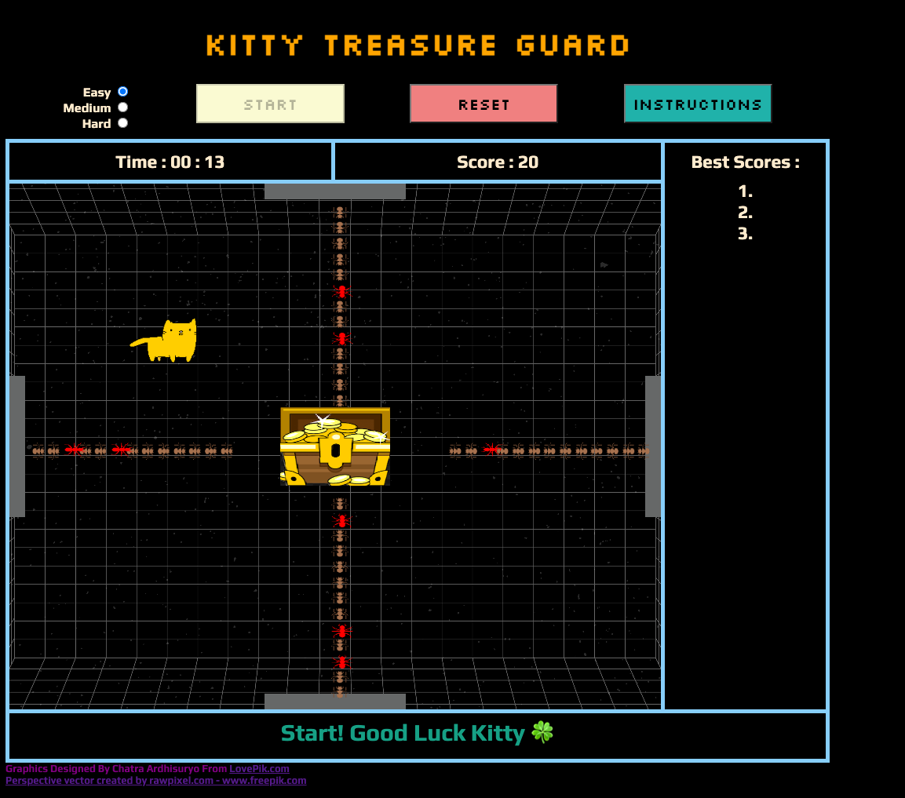

# Kitty Treasure Guard 
A simple game built where players move the main character, Kitty, around the canvas to make attacks and avoid obstacles to earn points and win the game by lasting 1 minute without losing.
* URL : https://valerieyang00.github.io/Project-1/

## Description of Game Rules
Help the kitty guard its treasures from the ants! 
Game begins with ants coming out from 4 bases, trying to reach the treasure placed in the middle of the room. Move the kitty around and stop the ants from getting to the treasure. Kitty is able to attack the 4 ant bases, which will clear the ants for 3 seconds. Kitty can also cut through the ants, which will slow down the ants for 3 seconds. However, it can only attack brown ants, as red ants are poisonous (game over). Kitty can hiss (press "h") to scare the ants 2 times in 1 game, and game will reset (only available in easy mode). Eat the fish to freeze ants for 2 seconds (+50 points) and avoid Traps which will end the game. Player's score goes up as kitty makes each attack until they lose the game. Avoid red blocks to higher score potential. Maximum game time is 1 minute (WIN!).

### Initial Wireframe

## Tech Used
-----
* HTML/CSS - Canvas
* Javascript

## MVP Accomplished
-------
* Game start button / Reset button / Instrucstions button
* A game canvas with treasure placed in middle
* Kitty character rendered - to move around the room freely with keypress
* Created 4 ant bases and ants to come out through out the game
* Randomized colors of ants (brown/red) in ideal proportion for the game play
* Set timers to stop/start ants as kitty makes its two attack methods: attack the ant base (stop ants for 3 seconds), attack brown ants before it gets to treasure (slows ants for 2 seconds). 
* Display loss and end the game if ants reach the treasure, or kitty stops a red ant
* End the game when player lasts 1 minute in the game, display maximum score
* Display scoreboard that tracks the player's score throughout the game and 3 best scores
* Set "h" key to restart the game (time keeps running), limiting to 2 times per game only in Easy mode. 

## Stretch Goals Accomplished
-------
* Easy/Medium/Hard mode with different ants speed and increasing ratio of red ants.
* Fish appears randomly throughout the game -  if Kitty eats the fish, ants are frozen for 2 seconds + 50 bonus points
* Traps appear randomly throughout the game - Game over at collision
* Added red blocks as new feature to avoid player from running around the edge the whole game
* Added background audio and sound effects for each move

### Final Look

## Approach.. Roadblocks.. and Reflection
---
I started out by writing out the game plan and listing different game pieces and logics I am going to need. Then I wrote out the basic HTML and CSS using Grid/Flexbox to have a layout and designated canvas area for the game to happen.

First roadblock came early over the weekend as none of my codes for canvas seemed to work the way I imagined to be. At that point I realized that I need to gain more understanding of canvas and overall game logics (loops) work. I read through W3School's canvas tutorial which helped me understand how everything works and come together in a game.
I had a slow start in javascript due to the initial hiccups, but used the weekend to speed up the process. I wrote out everything that needs to be done, and grouped them into list of tasks, as a way to manage my way through without getting overwhelmed. Having the project broken out to several small projects helped me to stay on track, and also feel small accomplishments along the way.

Second roadblock was various issues around adding images as game pieces. After spending hours with no luck, I switched gears to use rectangles and continued to build out all the game logics first. Then when I tried the images after, it worked like magic! I learned that sometimes, you need to go around a roadblock whether it's away from the computer, or switching  gear to different pieces of the job and attempt to resolve again later. I added timer, scoreboard, and instructions to shut off my brain from crazy game logics for a while, which helped me to think with a fresh mind once I returned to it.

Third roadblock was with the many setTimeouts and setIntervals I had to use since my game plan had lots of time controlled features. I used alot of boolean variables to control collision detection only once per action and to avoid infinite loops. This was the most painful roadblock as I seemed to always break one, as I fixed one.
After I built out general game logics that included everything in the MVP, I started testing to make sure I had built a functioning game before moving on to stretch goals. It had a lot of little bugs that I sorted out one by one. I learned alot about how javascript works in this process. There were many occasion computer was taking things differently than I imagined. The debugging throughout the project helped me to understand how computer accepts and interprets the codes written.

Once I had a functioning game, with minimal bugs, I added in the stretch goals I planned (fish, trap, game mode). As the logic worked similarly, it was fairly easy adds, minus the trouble I had with randomizer giving different value for each appearance without getting loops mixed up. Then I added some sound effects and background music to enhance the game experience as my last step. I was ready to test! After playing the game repetitively and trying out multiple scenarios, I came across many little bugs which mostly had to do with setTimeouts and setIntervals, which I fixed one by one to the best I can, in the time I had left.

### Post-project - Growth Areas and Looking Forward
---
After finishing the game and reviewing all my codes, one thing I want to get better at is DRYing my codes. I tried to eliminate as much repetitiveness as possible, but because I had 4 ant bases that had to work separately, I felt like I had to repeat many functions and variables. I am excited for the journey ahead to learn and write more efficient codes. Also, if I build another game in the future, I would love to use more animation and movements such as gravity and jump.

## Works Cited
-------
* Background Image:
<a href="https://www.freepik.com/vectors/perspective">Perspective vector created by rawpixel.com - www.freepik.com</a>

* Cat Image:
Graphics Designed By Chatra Ardhisuryo From <a href="https://lovepik.com/image-450071496/cartoon-yellow-cat-vector-illustration.html">LovePik.com</a>

* Treasure Image:
https://www.pngegg.com/en/png-wscab

* Red Ants Image:
https://www.clipartmax.com/download/m2H7K9A0i8K9m2H7_ant-clip-art/

* Brown Ants Image:
https://www.pngitem.com/so/ant/2/

* Fish Image:
<a href="https://flyclipart.com/fish-emoji-fish-emoji-png-763466">Fish Emoji - Fish Emoji PNG</a>

* Trap Image:
https://www.emojipng.com/preview/12914623

* Tutorial:
https://www.w3schools.com/graphics/game_intro.asp

* Audio:
Sound Effect from <a href="https://pixabay.com/sound-effects/?utm_source=link-attribution&amp;utm_medium=referral&amp;utm_campaign=music&amp;utm_content=6896">Pixabay</a>

